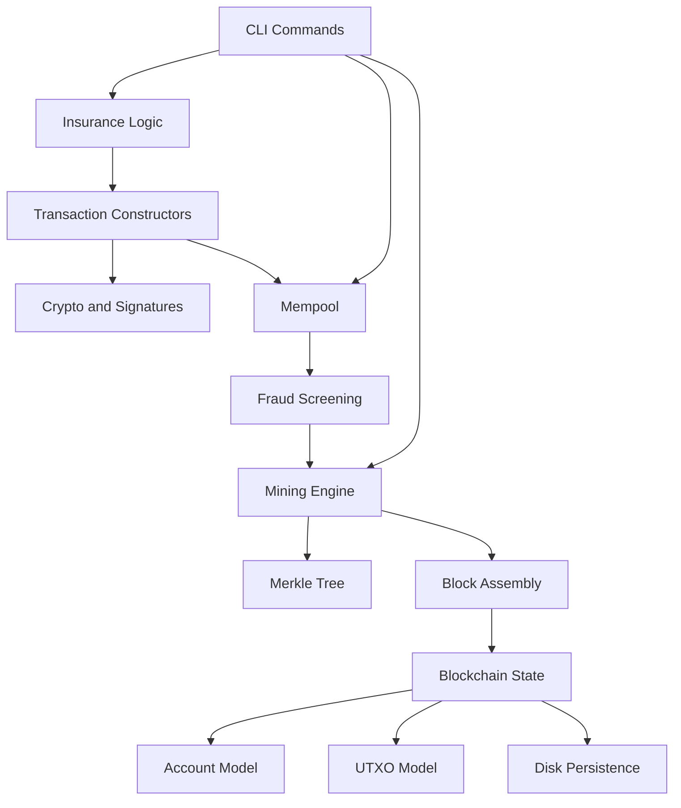
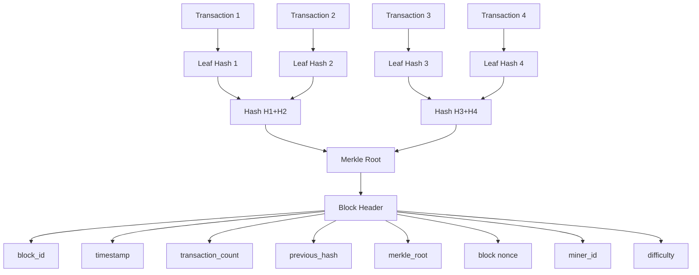
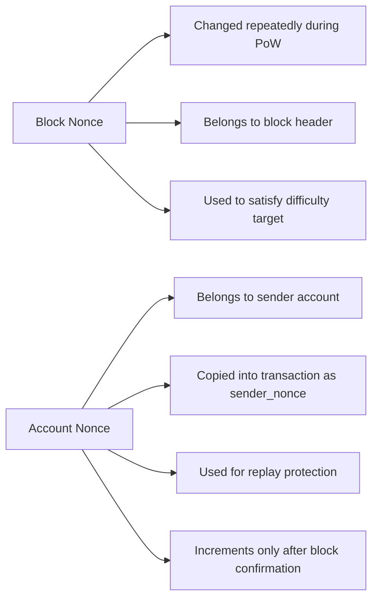
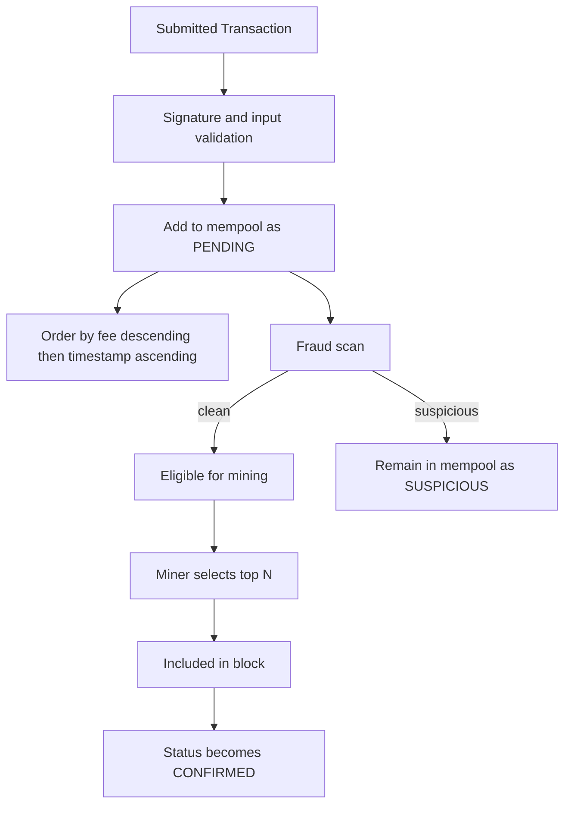
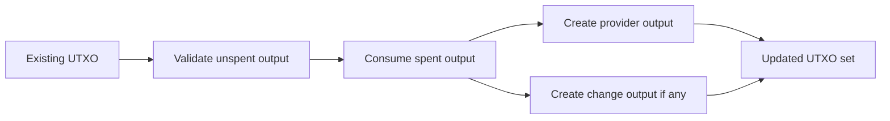
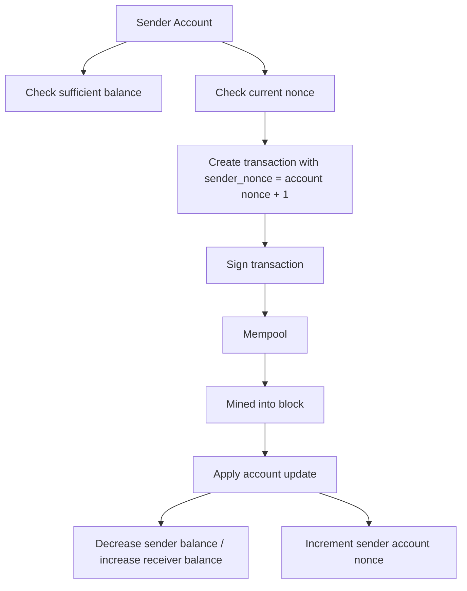
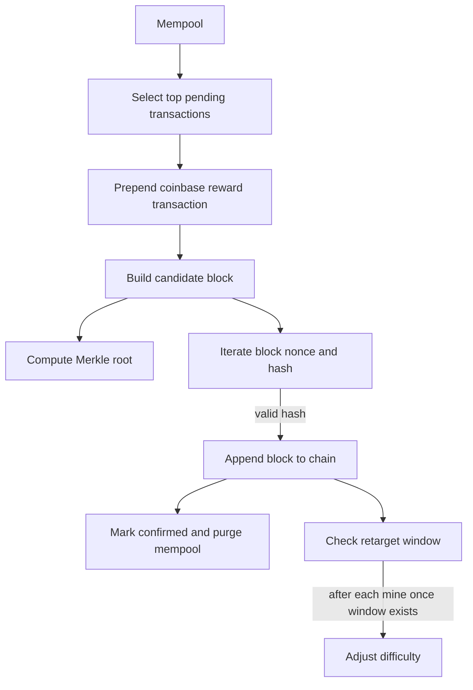
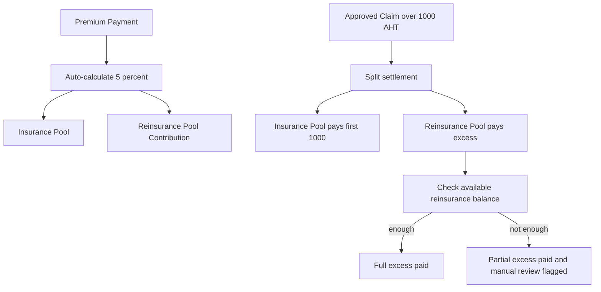
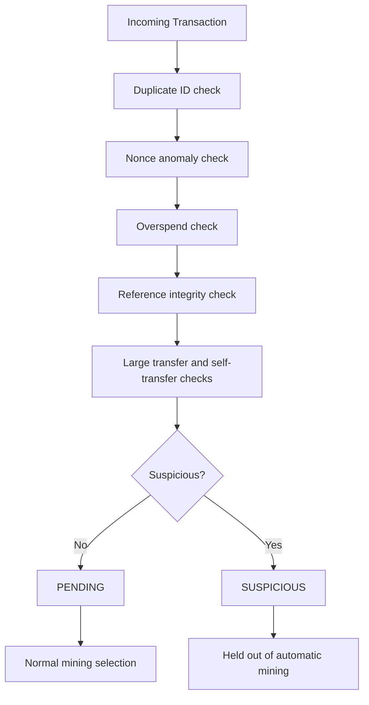

# System Design Diagram

This file provides the design diagrams required for submission using Mermaid.
If your final submission format prefers images, you can paste these diagrams into
Mermaid Live Editor or GitHub Markdown rendering and export screenshots.

## 1. Overall System Architecture

## 2. Block Structure and Merkle Tree

## 3. Block Nonce vs Account Nonce

## 4. Mempool Flow with Priority and Fraud Flagging

## 5. UTXO Transaction Flow

## 6. Account-Balance Flow with Nonce Management

## 7. Mining Workflow and Difficulty Retargeting

## 8. Reinsurance Contribution and Disbursement Flow

## 9. Fraud Detection Pipeline

